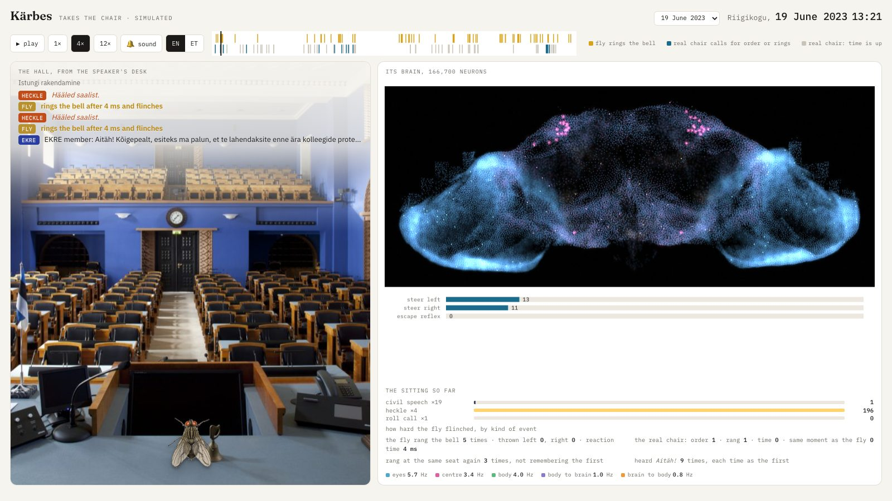

# Kärbes — the 102nd member takes the chair

A complete simulated fruit-fly brain, all 166,700 neurons of it, sits in the Speaker's seat of the
Estonian parliament while a real sitting is played to it. Every speech reaches it as a scent from the
speaker's side of the hall. Every insult comes straight at it. When its escape reflex fires, it rings
the bell.

**Watch it:** <https://stamkivi.github.io/fly-mp/> — pick a sitting, press play, sound on.



*Kärbes* is Estonian for "fly". The Riigikogu has 101 seats; this is a notional 102nd.

## The story

On 3 September 2026 the complete wiring diagram of a male fruit fly's central nervous system was
published: [MaleCNS](https://male-cns.janelia.org/), 166,000 neurons and 125 million synapses,
described in [*Cell*](https://doi.org/10.1016/j.cell.2026.08.015) by Janelia, the MRC Laboratory of
Molecular Biology, Cambridge and Google Research. Within a week people were running the whole brain
as a spiking network and wiring it to whatever was at hand: it
[piloted a drone](https://github.com/pietroagazzi/FlyDrones) from its own visual neurons,
[drove a car in CARLA](https://github.com/MarkUnthank/flyhard) and tried parallel parking,
[played Doom](https://github.com/nftechie/doomfly), [Minecraft](https://github.com/blendi-remade/fly-brain-minecraft)
and [Super Mario 64](https://github.com/ornata/fly), and did Beat Saber for 22 million viewers.
[404 Media](https://www.404media.co/a-digital-fly-brain-has-taken-over-the-internet/) has the
round-up; [awesome-fly](https://github.com/cobanov/awesome-fly) keeps the list.

This is one of those experiments. The question: what would the fly do as the 102nd member of the
Estonian parliament?

The Riigikogu publishes its transcripts, votes, bills and seating as
[open data](https://www.riigikogu.ee/en/open-data/) through a
[public API](https://api.riigikogu.ee/), so the first attempt was the obvious one. The fly read the
bills, smelled their subject matter through its olfactory receptors (*tax burden* here, *the Russian
threat* there), saw through its optic nerve who had tabled each bill, and voted by reflex. The hope
was to place it in a faction by its record.

That failed, twice over. First, this brain is purely reflexive: it has no memory, and every signal
between its neurons decays within a hundred milliseconds. Sniffing a bill is a wander between
disconnected keywords that never forms a picture. Second, and more interesting, across 784 bills the
single fact of *who tabled it* predicted the chamber's vote 94% of the time. Whatever the fly
smelled in the substance, the moment it saw the proposer's name it flew towards the coalition. That
is a metaphor a democracy might sit with for a moment.

So the fly was given a job it can do. The one parliamentary role that *is* a reflex is the chair's.

## What you are looking at

Two panels and a timeline.

- **The hall**, photographed from the Speaker's desk. Whoever is speaking gets a lamp on their seat,
  in their faction's colour. The transcript scrolls over the ceiling, second by second, straight from
  the Riigikogu's own stenographic record. The fly stands on the desk. When it flinches, the desk
  bell glows and you hear it.
- **Its brain**, drawn from the measured positions of 126,104 cell bodies, with the neurons that are
  firing at this moment drawn over it. Every speech wakes it from silence: the smell centre lights at
  5 ms, the memory centre at 15 ms, shown fourteen times slower than life. Below the plate: what its
  steering and escape neurons did, and a running tally the brain itself cannot keep.
- **The timeline**: gold ticks where the fly rang, blue where the real chair called for order or rang
  the bell, grey where the chair called time.

Its memory lasts about 20 milliseconds. It hears the hundredth *Aitäh!* as the first, and every
heckler is a stranger.

## Two sittings

| | 20 May 2026 | 19 June 2023 |
|---|---:|---:|
| what it was | an ordinary Wednesday: question time, then a plenary past midnight | the 27-hour extraordinary session: the tax package and the marriage equality bill tied to confidence votes, the opposition obstructing through the night |
| length | 12 h | 27 h |
| events shown to the fly | 316 | 846 |
| speeches read as hostile | 17% | 27% |
| recorded heckles | 11 | 43 |
| **the fly rang the bell** | **22** | **73** |
| real chair: called for order or rang | 0 | 16 |
| real chair: called time | 7 | 56 |
| fly and chair within two events of each other | 0 | 1 |

The fly can look a little neurotic. On 20 May the human chair never once called anyone to order,
while the fly tried to flee the podium 22 times. During the obstruction the human intervened 16
times for noise and procedure, and did so at the same moment as the fly, which reacts in 4 ms, once
in 73.

It is the same instrument on both days. A heckle drives its escape neuron to about 174 spikes on
both days, a civil speech to about 1, a vote to 0, with a reaction time of 4 ms every time. It rang
three times more often in June because four times more heckles and hostile speeches came at it. The
human chair is a different instrument: it polices the room; the fly polices the speaker.

## How it works

```
Riigikogu transcript ──► events (who, from which seat, what tone) ──► stimuli
                                                                        │
   MaleCNS connectome ──► spiking model of every neuron ◄───────────────┘
                                   │
                          giant fibre fires? ──► bell
```

1. **The transcript.** `/api/steno/verbatims` gives every utterance with a second-resolution
   timestamp and speaker; stage directions carry the heckles (*Hääl saalist*), the presence checks and
   the votes; the chair's own words carry its calls for order and its bell. `/api/hallplan` maps each
   member to a seat and a faction. Coalition sits to the fly's right, opposition to its left, as in
   the photograph.
2. **The tone.** Each speech is put to a language classifier with one calibrated question: how
   hostile is this, on a five-point scale, with a confidence. That number, not the fly, decides how
   threatening a speech is. Nothing else about the text reaches the brain.
3. **The stimuli.** A speech is a scent: the olfactory receptor neurons on the speaker's side are
   driven for a moment scaled to the speech's length. A hostile speech is also an object rushing at
   the fly, presented to the looming detectors of the eye on that side, harder the more hostile.
   A heckle is a hard, short loom. A vote or roll call is scent on both sides.
4. **The brain.** MaleCNS v1.0, the complete wiring of one male *Drosophila* (166,700 neurons,
   24.5 million synapses), run as a leaky integrate-and-fire network after Shiu et al. 2024, with
   excitation and inhibition assigned from the predicted neurotransmitters. Nothing is trained.
5. **The bell.** The giant fibre, DNp01, is the fly's escape reflex: one synapse from the looming
   detectors. When it fires, the fly rings. Its steering neurons decide which way it throws itself.

What the wiring adds, measured rather than assumed: a lateralised escape with a 4 ms latency and a
burst that lasts as long as the looming does; a threshold that a merely sharp speech rarely crosses
while a heckle always does; and a damping in which the speaker's own scent from the same side
halves the escape response. What it does not add: any judgement of tone, any memory, any view about
the bills.

## What it is not

The wiring is real; the inputs and outputs are metaphors. There are no "aye" neurons in a fly, and
no "bell" neurons: the mapping from transcript to stimulus and from giant fibre to bell is ours. It
makes no claim about what a fly experiences. The seating is reconstructed from seat numbers and the
photograph. MPs' words are public record and appear as they were spoken; the subject of the page is
the fly, not any member.

## What did not work first

Four iterations of the voting simulation are recorded in `FINDINGS.md` and `SPEC.md`: bills scored
on topic axes drove olfactory neurons, a descending-neuron rate difference was decoded into for or
against, and a randomly rewired brain was the control. They established what this brain can and
cannot do. The ring attractor holds nothing once its input stops. Hearing is unreliable for side.
Innate aversive smell produces no turn at any dose. The mushroom body saturates at any drive. And on
the voting task the real wiring scored below two of three random rewirings of itself, which is the
negative result the spec had pre-committed to reporting. The one thing the brain does with
conviction is flinch from a looming object: five times out of five at every dose, in four
milliseconds. That reflex is the whole of the chair.

## Running it

Python 3.11+ and [uv](https://docs.astral.sh/uv/). The MaleCNS files (1.06 GB), the Riigikogu cache
and the recordings are gitignored inputs.

```sh
uv sync --extra dev --extra score
bash scripts_fetch.sh                      # MaleCNS feathers → data/malecns/
uv run karbes harvest                      # Riigikogu votes and bills → data/raw/ (80 min, rate-limited)
uv run python scripts/fetch_steno.py       # transcripts → data/raw/steno/
cp .env.example .env                       # TYPESAFE_API_KEY for the tone classifier
uv run python scripts/record_sitting.py data/raw/steno/2023-06-19.json runs/chair/2023-06-19.json
uv run python scripts/build_site.py        # docs/ (GitHub Pages) and runs/page/ (single files)
uv run pytest
```

`page/sittings.json` lists the sittings the site is built from. `docs/` is the built site, served
by GitHub Pages straight from the branch.

Repository layout: `karbes/riigikogu` fetches and caches; `karbes/graph` loads the connectome into
sparse matrices and assigns signs; `karbes/sim` is the event-driven LIF kernel; `karbes/sitting.py`,
`tone.py`, `hall.py` and `chair.py` turn a transcript into stimuli and record the reactions;
`chairpage.py`, `landing.py` and `page/` build the pages. `SPEC.md` is the design record with the live
measurements it rests on; `FINDINGS.md` is what each iteration found.

## Credits and licences

- **Connectome:** [MaleCNS v1.0](https://male-cns.janelia.org/), HHMI Janelia FlyEM with the MRC LMB, Cambridge
  and Google Research, CC BY 4.0. Paper: *Sexual dimorphism in the complete Drosophila male central
  nervous system connectome*, [*Cell*, 3 September 2026](https://doi.org/10.1016/j.cell.2026.08.015).
- **Model:** the leaky integrate-and-fire formulation of Shiu et al. 2024 (*Nature*), run with
  mlx-lif-engine (MIT). `philshiu/Drosophila_brain_model` was used as the specification.
- **Transcripts, seating, votes:** Riigikogu open data, CC BY-SA 3.0. Estonian text is kept
  verbatim.
- **Tone classifier:** TypeSafe Jev, one question per speech, results cached.
- **Hall photograph:** Paul Kuimet, Riigikogu, under the Riigikogu photo archive terms: shown
  unaltered, non-commercially, with attribution; the lights, the bell's glow and the fly are drawn
  on a layer above it.
- **Fly illustration:** Orkin. Not under a free licence; see `page/assets/CREDITS.md`.
- **Brain image:** rendered from MaleCNS cell-body positions; not a photograph of a specimen.
- **Type:** Fraunces, IBM Plex Sans and IBM Plex Mono via Google Fonts.

## Licence

The code, the findings and the built pages in this repository are released under
[Creative Commons Attribution 4.0 International](LICENSE) (CC BY 4.0): use, adapt and redistribute
with credit. Creative Commons itself notes that its licences are not written with software in mind
and grant no patent rights; that is accepted here for a project whose substance is the analysis and
the pages rather than a library. The connectome, the transcripts and the images keep the licences
listed above.
